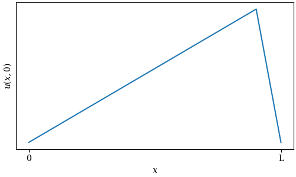

# string_instrument

## What is this?

When you watch someone play a guitar, it's hard to make out exactly how the strings are vibrating - all you can really see is a blur. If we want to see what the strings are doing on the scale of milliseconds, we would need a really expensive camera. Alternatively, we can simulate the strings using some simple physics, and get a pretty good idea of what the strings are *probably* up to.

## The classical wave equation

Waves in a string are traditionally represented by the *wave equation*, a 2nd-order linear PDE:

$$\frac{\partial^2u}{\partial t^2}=c^2\frac{\partial^2u}{\partial x^2}$$

$u(x,t)$ represents the displacement of the string at position $x$, time $t$. This equation relates the acceleration of the string to its curvature. The constant $c$ is the propagation speed of a wave in the string, and it is equal to the square root of the tension divided by the linear density of the string:

$$c=\sqrt{\frac{T}{\rho}}$$

This equation can be solved without too much trouble (see any introductory physics or differential equations textbook). The fact that this is a linear PDE means that any two solutions can be added to get a third solution. For the boundary conditions of a vibrating string of length $L$, i.e. $u(0,t)=u(L,t)=0$, the solutions are of the form:

$$u(x,t)=A\sin\left(\frac{n\pi x}{L}\right)\sin\left(\omega t\right)\;\;\;\;n=1, 2, 3\dots$$

The important takeaway from this is that any solution of the wave equation can be expressed as a sum of sine-wave-like solutions. Each possible value of $n$ is called a *harmonic*.

If we introduce damping into the system, the classic wave equation becomes:

$$\frac{\partial^2u}{\partial t^2}=c^2\frac{\partial^2u}{\partial x^2}-\mu(x)\frac{\partial u}{\partial t}$$

where $\mu$ represents the strength of damping. The variation of $\mu$ with $x$ is important, since selectively damping the strings allows the musician to vary the tone of the instrument.

## The system

We're going to model the E string on my bass guitar, which looks like this:

The origin of the x-axis is at the *nut*, where the strings enter the neck. The string ends at the *bridge*, where $x=L$.

The oval-shaped protrusion to the left of the bridge is the *pickup*, an device which uses electromagnetic induction to convert the vibration of the strings into an electrical signal. We will get an "electrical signal" from our simulation by sampling the displacement of the string at a single point.

## Initial condition

There are a number of ways to set a string in motion. The simplest of these involve pulling on the string at a single point and releasing it, meaning the initial condition of the freely-vibrating string looks like a triangle:

We can choose to pluck the string close to the bridge or closer to the middle, which will affect the timbre of the instrument:

Alternatively, instead of pulling and releasing the string, we can quickly strike it. This is a common technique among bass players, both upright and electric; and it's also the mechanism behind the sound of a piano. This condition can be modelled by zero initial displacement, but a local spike in initial velocity:

## Damping

The effect of damping on the string's behavior is one of the more interesting things to investigate here. We'll look at two important cases: palm muting and harmonics.

Palm muting is an important guitar technique, especially in rock and metal music, which involves the guitarist holding the side of their picking hand against the strings near the bridge to mute them. This can be approximated by a higher value of $\mu$ right next to the bridge:

Playing harmonics is a technique used for any number of string instruments. By lightly muting the string at position $\frac{L}{n}$, every harmonic will be muted except those that have a node at that position. For example, my muting the string at position $\frac{L}{2}$:

we can isolate even-numbered harmonics. By muting at $\frac{L}{3}$:

we can isolate harmonics that are multiples of 3.

## The numerical approach

Since we are dealing with complicated damping conditions, we are going to outsource all the thinking to a computer. In order for the computer to simulate the string, we'll need to discretize it.

Instead of a continuous string of constant linear density $\rho$, let's consider a massless string loaded with uniformly spaced point masses of mass $m$ spaced distance $\Delta x$ apart, such that $\frac{m}{\Delta x}=\rho$. The acceleration of each particle depends on how far it is from each of its neighbors, which gives a discrete version of the second derivative. For particle $i$:

$$\frac{d^2u_i}{dt^2}=c^2\frac{u_{i+1}+u_{i-1}-2u_i}{\Delta x^2}-\mu_i\frac{du_i}{dt}$$

If the displacement of particle $i$ is exactly halfway between its neighbors, it will experience zero acceleration (save for that caused by damping). If its displacement is greater or less than the average of its neighbors, it will experience an acceleration towards their average. The particle will also experience an acceleration proportional to the magnitude of its velocity and opposite its direction, due to damping.

We have replaced our single 2nd-order PDE with a system of $n$ 2nd-order ODEs. However, the solver we'll be using only operates on 1st-order equations. To proceed further, we'll need to turn $n$ 2nd-order ODEs into $2n$ 1st-order ODEs.

We can do this with the following substitution:

$$v_i=\frac{du_i}{dt}$$

$$\frac{dv_i}{dt}=\frac{T}{\rho}\frac{u_{i+1}+u_{i-1}-2u_i}{\Delta x^2}-\mu_i v_i$$

We will have $n$ copies of the first equation, and $n$ copies of the second.